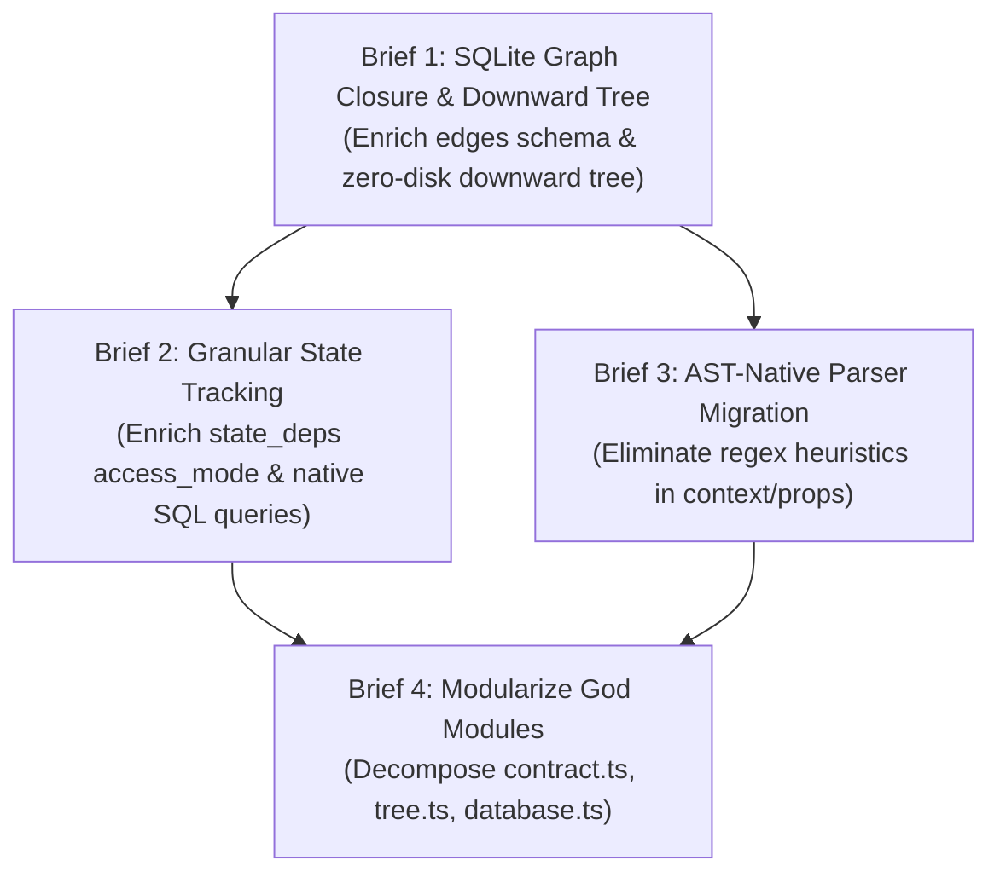

# Task Briefs Manifest Index

> **Single Source of Truth (SSOT) Manifest** untuk seluruh dokumen Task Brief aktif pada proyek `@dimassetoid/strata-mcp`.

---

## Active Briefs Matrix

| No | Kategori | Judul Brief | Status | Dokumen Link | Tanggal |
| :---: | :--- | :--- | :---: | :--- | :---: |
| 1 | `refactor` | SQLite Graph Closure & Zero-Disk Downward Tree Traversal | `Completed` | [sqlite-graph-closure-and-downward-tree.md](file:///home/shironim/Project/strata-mcp/docs/brief/2026-09/refactor/sqlite-graph-closure-and-downward-tree.md) | 2026-09-19 |
| 2 | `refactor` | Granular State Tracking & Mutator/Reader Ingestion | `Completed` | [granular-state-access-tracking.md](file:///home/shironim/Project/strata-mcp/docs/brief/2026-09/refactor/granular-state-access-tracking.md) | 2026-09-19 |
| 3 | `refactor` | AST-Native Parser Migration (Eliminating Heuristic RegEx) | `Completed` | [ast-native-parser-migration.md](file:///home/shironim/Project/strata-mcp/docs/brief/2026-09/refactor/ast-native-parser-migration.md) | 2026-09-19 |
| 4 | `refactor` | Modularize Engine God Modules (Decomposing SRP Violations) | `Draft` | [modularize-engine-god-modules.md](file:///home/shironim/Project/strata-mcp/docs/brief/2026-09/refactor/modularize-engine-god-modules.md) | 2026-09-19 |

---

## Roadmap Rekomendasi Urutan Pengerjaan

